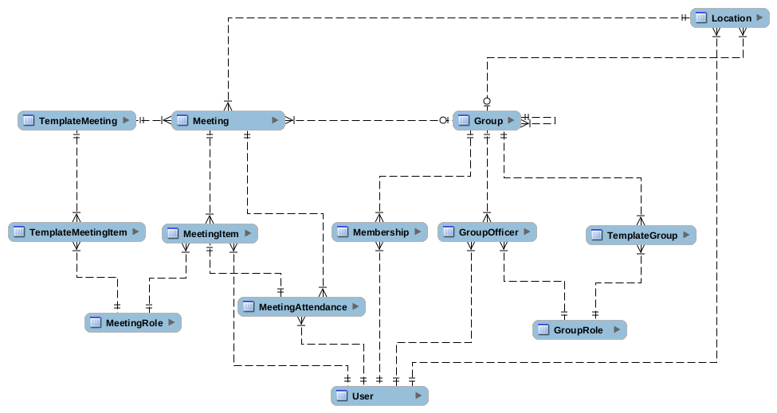

# Database structure

This folder contains a project file for MYSQL Workbench (relict of old times),
We will most likely not use MYSQL as database.

Delete the folder when the structure is in place.

## Not clear

1. `MeetingItem` should probably inherit from `MeetingAttendance`
2. `Location` should have also a `start` and `end` dates, 
    only records with `end` date should be shown,
    possibly more permissions are required to see locations history.
3. `Group` is a nested structure, using `TemplateGroup` will be used for 
    creating new groups and assigning officers in them (`GroupRole`).